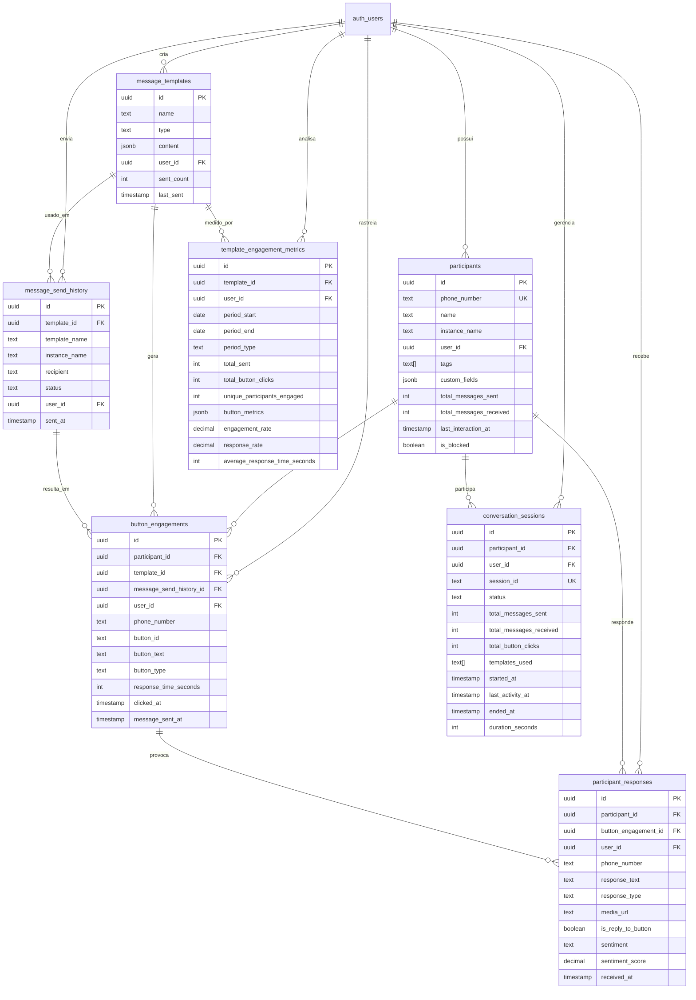
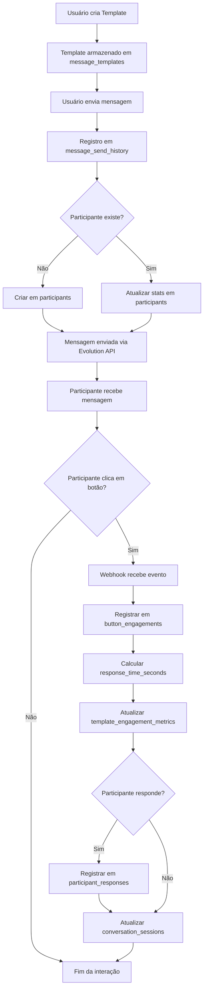
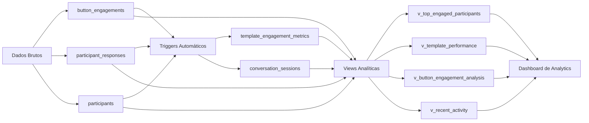

# Diagrama de Relacionamento - Sistema de Engajamento

## Estrutura de Tabelas



## Fluxo de Dados



## Fluxo de Análise



## Hierarquia de Dados

```
auth_users (Usuário do Sistema)
├── message_templates (Templates criados)
│   ├── message_send_history (Histórico de envios)
│   │   └── button_engagements (Cliques em botões)
│   │       └── participant_responses (Respostas)
│   └── template_engagement_metrics (Métricas agregadas)
│
├── participants (Contatos/Participantes)
│   ├── button_engagements (Engajamentos)
│   ├── participant_responses (Respostas)
│   └── conversation_sessions (Sessões de conversa)
│
└── conversation_sessions (Sessões ativas)
    ├── Mensagens enviadas
    ├── Mensagens recebidas
    └── Cliques em botões
```

## Relacionamentos Principais

### 1. Participante → Engajamentos
- **1:N** - Um participante pode ter múltiplos engajamentos
- **Cascade**: Deletar participante remove seus engajamentos
- **Índice**: `participant_id` para queries rápidas

### 2. Template → Métricas
- **1:N** - Um template tem múltiplas métricas (por período)
- **Cascade**: Deletar template remove suas métricas
- **Unique**: `(template_id, period_start, period_end, period_type)`

### 3. Engajamento → Resposta
- **1:1 ou 1:N** - Um clique pode gerar uma ou mais respostas
- **Set Null**: Deletar engajamento mantém resposta (histórico)
- **Índice**: `button_engagement_id` para rastreamento

### 4. Participante → Sessões
- **1:N** - Um participante pode ter múltiplas sessões
- **Cascade**: Deletar participante remove suas sessões
- **Status**: Sessões podem estar ativas, completas ou abandonadas

## Índices e Performance

### Índices Principais
```sql
-- Participantes
idx_participants_user_id          -- Filtrar por usuário
idx_participants_phone_number     -- Buscar por telefone
idx_participants_last_interaction -- Ordenar por atividade
idx_participants_tags             -- Buscar por tags (GIN)

-- Engajamentos
idx_button_engagements_participant_id  -- Join com participantes
idx_button_engagements_template_id     -- Join com templates
idx_button_engagements_clicked_at      -- Ordenar por data
idx_button_engagements_button_id       -- Agrupar por botão

-- Métricas
idx_template_metrics_template_id  -- Filtrar por template
idx_template_metrics_period       -- Filtrar por período
```

### Queries Otimizadas

```sql
-- Usar índice em phone_number
SELECT * FROM participants 
WHERE phone_number = '5511999999999'
  AND user_id = 'user-uuid';

-- Usar índice em clicked_at
SELECT * FROM button_engagements
WHERE clicked_at > NOW() - INTERVAL '7 days'
ORDER BY clicked_at DESC;

-- Usar índice composto em métricas
SELECT * FROM template_engagement_metrics
WHERE template_id = 'template-uuid'
  AND period_start >= '2024-01-01'
  AND period_type = 'daily';
```

## Triggers e Automação

### 1. update_participant_stats_on_send
- **Quando**: Após INSERT em `message_send_history`
- **Ação**: Atualiza ou cria participante
- **Campos atualizados**: `total_messages_sent`, `last_interaction_at`

### 2. calculate_response_time_trigger
- **Quando**: Antes de INSERT em `button_engagements`
- **Ação**: Calcula `response_time_seconds`
- **Fórmula**: `clicked_at - message_sent_at`

### 3. update_metrics_on_button_click
- **Quando**: Após INSERT em `button_engagements`
- **Ação**: Atualiza métricas diárias do template
- **Campos atualizados**: `total_button_clicks`, `unique_participants_engaged`

## Segurança (RLS)

Todas as tabelas têm Row Level Security habilitado:

```sql
-- Política padrão para todas as tabelas
CREATE POLICY "Users can view their own data"
  ON table_name FOR SELECT
  USING (auth.uid() = user_id);

CREATE POLICY "Users can manage their own data"
  ON table_name FOR ALL
  USING (auth.uid() = user_id);
```

Isso garante que:
- ✅ Usuários só veem seus próprios dados
- ✅ Usuários não podem acessar dados de outros
- ✅ Queries automáticas filtram por `user_id`
- ✅ Segurança em nível de banco de dados

## Capacidade e Escalabilidade

### Estimativas de Armazenamento

```
Participantes:
- 10.000 participantes ≈ 5 MB
- 100.000 participantes ≈ 50 MB
- 1.000.000 participantes ≈ 500 MB

Engajamentos:
- 100.000 cliques ≈ 20 MB
- 1.000.000 cliques ≈ 200 MB
- 10.000.000 cliques ≈ 2 GB

Métricas (agregadas):
- 1 ano de dados diários ≈ 1 MB por template
- 100 templates x 1 ano ≈ 100 MB
```

### Recomendações de Limpeza

```sql
-- Arquivar dados antigos (executar mensalmente)
-- Manter últimos 12 meses de dados detalhados
DELETE FROM button_engagements
WHERE clicked_at < NOW() - INTERVAL '12 months';

-- Manter métricas agregadas por mais tempo
-- Deletar apenas após 2 anos
DELETE FROM template_engagement_metrics
WHERE period_start < NOW() - INTERVAL '24 months';
```
